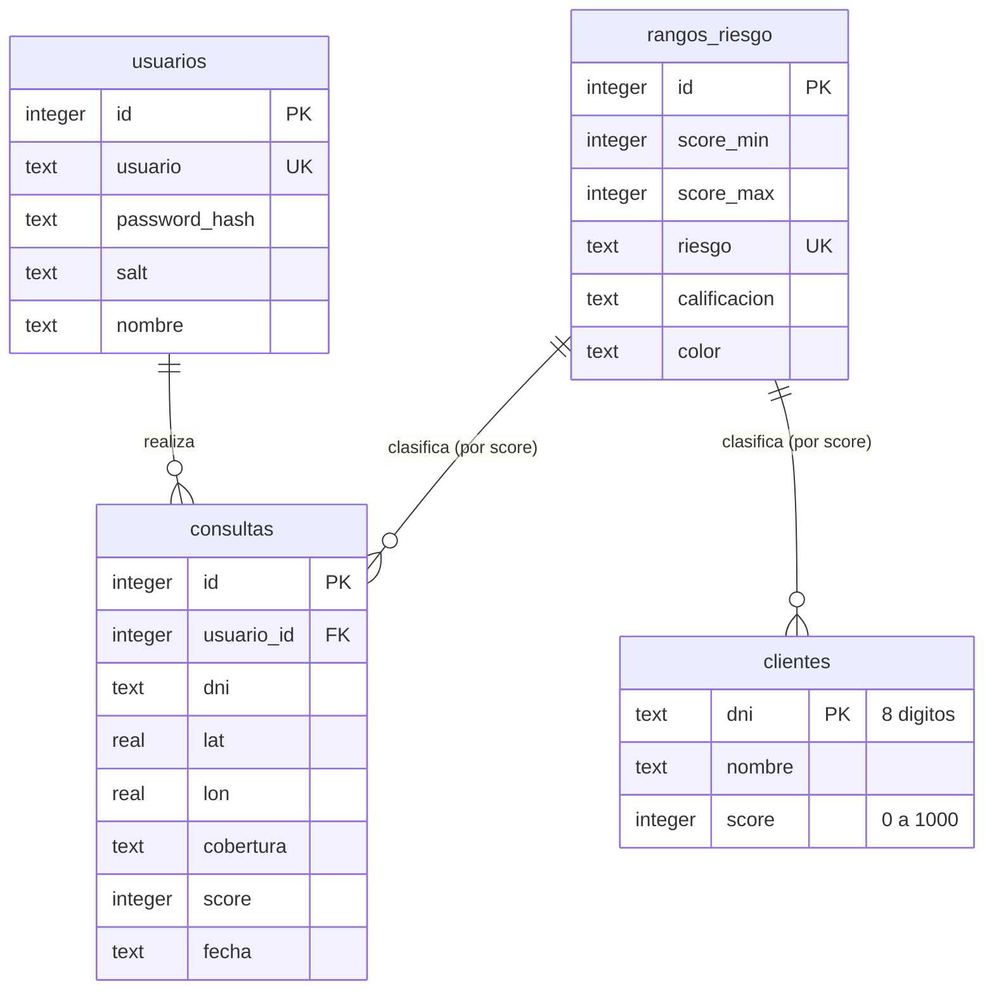

# Base de datos

La aplicación usa **SQLite** (un solo archivo, sin servidor) a través del
módulo estándar `sqlite3`. El archivo vive en `datos/jsconnect.db` (o donde
apunte la variable de entorno `JSCONNECT_DB`) y se crea solo, con datos de
ejemplo, la primera vez que se ejecuta la app.

## Diagrama entidad-relación



La relación entre `clientes`/`consultas` y `rangos_riesgo` no es una clave
foránea: es un `JOIN` por rango (`score BETWEEN score_min AND score_max`), así
que un cliente nunca "guarda" su riesgo — se calcula en el momento a partir de
su score.

## Diccionario de datos

### `usuarios`
Cuentas que pueden iniciar sesión en la aplicación.

| Columna | Tipo | Descripción |
|---|---|---|
| `id` | INTEGER PK | Identificador interno. |
| `usuario` | TEXT UNIQUE NOT NULL | Nombre de usuario para el login. |
| `password_hash` | TEXT NOT NULL | Hash PBKDF2-SHA256 de la contraseña (100 000 iteraciones). |
| `salt` | TEXT NOT NULL | Salt aleatorio (16 bytes, en hexadecimal) usado al calcular el hash. |
| `nombre` | TEXT | Nombre para mostrar. |

La contraseña **nunca se guarda en texto plano**: se calcula
`PBKDF2(password, salt)` y se compara ese hash contra el guardado.

### `clientes`
Las personas que se pueden consultar por DNI.

| Columna | Tipo | Descripción |
|---|---|---|
| `dni` | TEXT PK | Exactamente 8 dígitos numéricos (`CHECK`). |
| `nombre` | TEXT NOT NULL | Nombre completo. |
| `score` | INTEGER NOT NULL | Entre 0 y 1000 (`CHECK`). |

Índice `idx_clientes_nombre` sobre `nombre`, para que la búsqueda por nombre en
el explorador de clientes no recorra la tabla completa.

### `rangos_riesgo`
La tabla de clasificación de riesgo por score, editable sin tocar código.

| Columna | Tipo | Descripción |
|---|---|---|
| `id` | INTEGER PK | Identificador interno. |
| `score_min` | INTEGER NOT NULL | Límite inferior del rango (incluido). |
| `score_max` | INTEGER NOT NULL | Límite superior del rango (incluido). |
| `riesgo` | TEXT UNIQUE NOT NULL | Nivel de riesgo ("Muy Alto"… "Muy Bajo"). |
| `calificacion` | TEXT NOT NULL | Calificación en palabras ("Malo"… "Excelente"). |
| `color` | TEXT NOT NULL | Color hexadecimal usado en la interfaz. |

`CHECK (score_min <= score_max)`. Se llena una sola vez, al crear la base, con
los 5 rangos oficiales del proyecto.

### `consultas`
El historial de validaciones hechas por cada usuario.

| Columna | Tipo | Descripción |
|---|---|---|
| `id` | INTEGER PK | Identificador interno. |
| `usuario_id` | INTEGER FK → `usuarios.id` | Quién hizo la consulta (`ON DELETE SET NULL`). |
| `dni` | TEXT NOT NULL | DNI consultado (no valida que exista en `clientes`: se puede consultar un DNI que no está registrado). |
| `lat`, `lon` | REAL NOT NULL | Coordenadas usadas en la validación de cobertura. |
| `cobertura` | TEXT NOT NULL | Resultado de cobertura ("SI"). |
| `score` | INTEGER | Score encontrado, o `NULL` si el DNI no estaba registrado. |
| `fecha` | TEXT | Fecha y hora local, puesta automáticamente por SQLite. |

## Consultas de ejemplo

**Riesgo de un cliente (el JOIN que usa la aplicación):**
```sql
SELECT c.dni, c.nombre, c.score, r.riesgo, r.calificacion
FROM clientes c
LEFT JOIN rangos_riesgo r ON c.score BETWEEN r.score_min AND r.score_max
WHERE c.dni = '12345678';
```

**Cuántos clientes hay en cada nivel de riesgo:**
```sql
SELECT r.riesgo, COUNT(*) AS total
FROM clientes c
JOIN rangos_riesgo r ON c.score BETWEEN r.score_min AND r.score_max
GROUP BY r.riesgo
ORDER BY r.score_min DESC;
```

**Últimas 20 consultas de un usuario:**
```sql
SELECT fecha, dni, cobertura, score
FROM consultas
WHERE usuario_id = 1
ORDER BY id DESC
LIMIT 20;
```

## Catálogo de consultas con JOIN (pantalla "Consultas SQL")

La aplicación trae, listas para ejecutar desde la interfaz, cinco consultas que
muestran distintos tipos de `JOIN` sobre las mismas tablas. Viven en
`validator_app/core/db.py` (diccionario `CONSULTAS_CATALOGO`) y se ejecutan con
`ejecutar_consulta_catalogo(conn, clave)`.

**1. `clientes_riesgo` — INNER JOIN simple.** Cada cliente con su nivel de
riesgo. Con `INNER JOIN`, solo aparecen clientes que sí encuentran un rango
coincidente (siempre pasa, porque los rangos cubren 0–1000 completo).
```sql
SELECT c.dni, c.nombre, c.score, r.riesgo
FROM clientes c
INNER JOIN rangos_riesgo r ON c.score BETWEEN r.score_min AND r.score_max
ORDER BY c.score DESC
LIMIT 200;
```

**2. `riesgo_conteo` — LEFT JOIN.** Parte de `rangos_riesgo` (5 filas fijas) y
cuenta clientes. Con `LEFT JOIN`, un nivel sin ningún cliente igual aparecería
con `total_clientes = 0`; con `INNER JOIN` desaparecería de la lista — esa es
la diferencia que esta consulta está pensada para mostrar.
```sql
SELECT r.riesgo, r.calificacion, COUNT(c.dni) AS total_clientes
FROM rangos_riesgo r
LEFT JOIN clientes c ON c.score BETWEEN r.score_min AND r.score_max
GROUP BY r.id
ORDER BY r.score_min;
```

**3. `historial_completo` — INNER JOIN múltiple (3 tablas).** Une `consultas`
con `usuarios` (quién la hizo) y con `clientes` (a quién se consultó). Al ser
`INNER JOIN` en ambos casos, solo aparecen consultas con usuario válido y con
un DNI que sí está registrado en `clientes`.
```sql
SELECT q.fecha, u.usuario, c.nombre AS cliente, q.dni, q.score
FROM consultas q
INNER JOIN usuarios u ON u.id = q.usuario_id
INNER JOIN clientes c ON c.dni = q.dni
ORDER BY q.id DESC
LIMIT 200;
```

**4. `nunca_consultados` — LEFT JOIN (antijoin).** `LEFT JOIN` de `clientes`
hacia `consultas`, quedándose solo con las filas sin coincidencia
(`q.id IS NULL`). Es la forma clásica de responder "qué hay en A que no está
en B".
```sql
SELECT c.dni, c.nombre, c.score
FROM clientes c
LEFT JOIN consultas q ON q.dni = c.dni
WHERE q.id IS NULL
ORDER BY c.nombre
LIMIT 200;
```

**5. `promedio_por_riesgo` — INNER JOIN + agregación.** El mismo patrón que
usa el dashboard, pero con `AVG` en vez de `COUNT`: agrupa los clientes por su
rango de riesgo y calcula el promedio de su score.
```sql
SELECT r.riesgo, COUNT(*) AS clientes, ROUND(AVG(c.score), 1) AS score_promedio
FROM clientes c
INNER JOIN rangos_riesgo r ON c.score BETWEEN r.score_min AND r.score_max
GROUP BY r.id
ORDER BY r.score_min;
```
